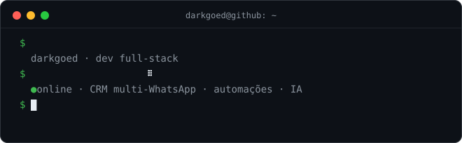

# darkgoed

Desenvolvedor focado em produtos digitais: sistemas web, CRMs, automações com IA e ferramentas técnicas.

Transformo ideias soltas em projetos utilizáveis — do backend ao painel, do firmware ao deploy.

## Projetos

| Projeto | O que é |
| --- | --- |
| **AtendON** · [atendon](https://github.com/darkgoed/atendon) | CRM de atendimento multi-WhatsApp: automações, IA no fluxo de conversa, agendamento e painel em tempo real |
| **darkzero** · [darkzero](https://github.com/darkgoed/darkzero) | Firmware multi-ferramenta para ESP32, construído com PlatformIO |

## Stack

  
  
  
  
  
  
  
  
  
  
  

## Como eu trabalho

- Interfaces objetivas, responsivas e orientadas ao uso real.
- Backends simples de manter, com foco em entrega e estabilidade.
- Automações para eliminar trabalho repetitivo e acelerar operações.

  
  

